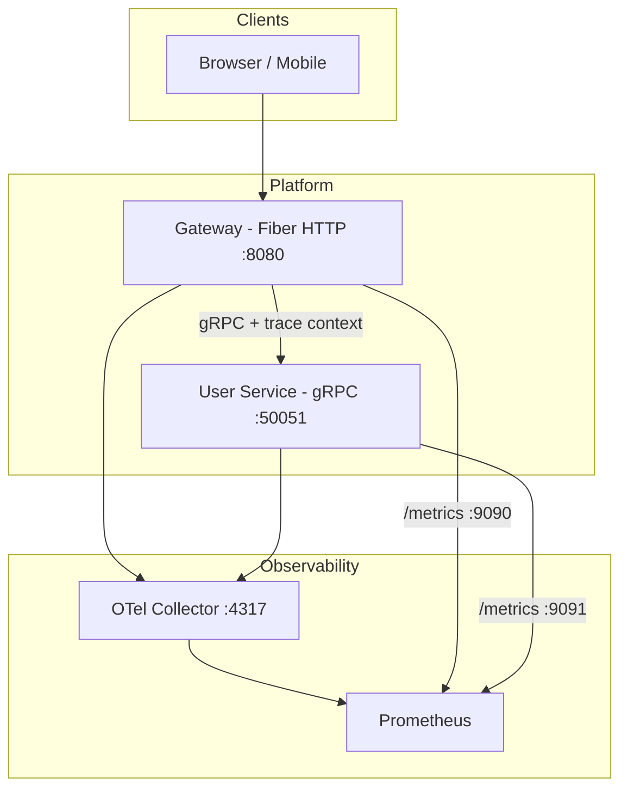

# Go gRPC Microservice Template

A production-ready Go backend template for building microservices with **gRPC**, **Fiber HTTP gateway**, centralized **protobuf** contracts, **observability**, and **Kubernetes** deployment.

Inspired by [go-fiber-template](https://github.com/imkhoirularifin/go-fiber-template).

## Features

| Area | Stack |
|------|-------|
| Language | Go 1.22 |
| HTTP | [Fiber v2](https://gofiber.io/) |
| RPC | gRPC with centralized `.proto` contracts |
| Proto tooling | [Buf](https://buf.build/docs) (lint, breaking changes, code generation) |
| Proto versioning | Git submodule + semantic version tags |
| Tracing | OpenTelemetry (OTLP gRPC exporter) |
| Metrics | Prometheus (`/metrics` on dedicated ports) |
| Logging | Zerolog (structured JSON / console) |
| Local dev | [Tilt](https://docs.tilt.dev) |
| Deployment | Docker + Kubernetes (Kustomize) |
| CI | GitHub Actions (buf lint, test, build) |

## Architecture



## Quick start

### Prerequisites

- Go 1.22+
- [Buf CLI](https://buf.build/docs/installation)
- Docker
- [Tilt](https://docs.tilt.dev/install.html) (recommended)
- kubectl + local Kubernetes (kind, minikube, or Docker Desktop)

### Setup

```bash
git clone https://github.com/imkhoirularifin/go-grpc-microservice-template.git
cd go-grpc-microservice-template

cp .env.example .env
git submodule update --init --recursive   # proto contracts
make proto
go mod tidy
```

### Run locally (without Kubernetes)

Terminal 1 — user gRPC service:

```bash
OTEL_SERVICE_NAME=user-service go run ./cmd/user
```

Terminal 2 — HTTP gateway:

```bash
OTEL_SERVICE_NAME=gateway go run ./cmd/gateway
```

Test:

```bash
curl http://localhost:8080/api/v1/healthz
curl http://localhost:8080/api/v1/users/1
curl http://localhost:8080/api/v1/users
```

### Run with Tilt (recommended)

```bash
kind create cluster --name go-grpc-template   # one-time setup
tilt up
```

Tilt UI: http://localhost:10350

## Project layout

```
.
├── cmd/
│   ├── gateway/              # Fiber HTTP entrypoint
│   └── user/                 # gRPC user service entrypoint
├── internal/
│   ├── gateway/              # HTTP handlers + server wiring
│   └── user/                 # gRPC handlers + business logic
├── pkg/
│   ├── config/               # Environment-based configuration
│   ├── grpcutil/             # gRPC server/client with OTel
│   ├── logger/               # Zerolog setup
│   └── observability/        # Tracing + Prometheus metrics
├── lib/                      # Shared HTTP utilities (dto, error handling)
├── proto/contracts/          # Centralized protobuf (git submodule)
├── gen/go/                   # Generated protobuf Go code
├── deploy/
│   ├── docker/               # Multi-stage Dockerfiles
│   ├── kubernetes/           # Kustomize manifests
│   └── monitoring/           # Prometheus + OTel collector configs
├── docs/
│   ├── CONTRIBUTING.md       # How to contribute
│   └── ADDING_NEW_FEATURE.md # End-to-end feature guide
├── buf.yaml / buf.gen.yaml   # Buf configuration
├── Tiltfile                  # Local development orchestration
└── Makefile                  # Common tasks
```

## Protobuf workflow

Centralized contracts live in `proto/contracts/` as a **git submodule**:

```bash
# First-time setup (replace with your proto repo)
git submodule add -b v1.0.0 https://github.com/your-org/proto-contracts proto/contracts

# Bump version
cd proto/contracts && git checkout v1.1.0 && cd ../..
make proto
```

```bash
make proto          # Generate Go code
make proto-lint     # Lint .proto files
make proto-breaking # Check breaking changes vs main
```

## Makefile targets

| Command | Description |
|---------|-------------|
| `make proto` | Generate Go code from protobuf |
| `make proto-lint` | Lint protobuf definitions |
| `make proto-breaking` | Detect breaking proto changes |
| `make test` | Run unit tests |
| `make build` | Build gateway and user binaries |
| `make run-gateway` | Run HTTP gateway |
| `make run-user` | Run user gRPC service |
| `make docker-build` | Build Docker images |
| `make tilt` | Start Tilt local development |

## Deployment

### Docker

```bash
make docker-build
```

### Kubernetes

```bash
kubectl apply -k deploy/kubernetes/overlays/dev
```

Production overlays can be added under `deploy/kubernetes/overlays/production`.

## Observability

| Endpoint | Service | Purpose |
|----------|---------|---------|
| `http://localhost:8080/api/v1/healthz` | Gateway | Liveness |
| `http://localhost:8080/api/v1/readyz` | Gateway | Readiness |
| `http://localhost:9090/metrics` | Gateway | Prometheus metrics |
| `http://localhost:9091/metrics` | User | Prometheus metrics |
| `localhost:4317` | OTel Collector | OTLP trace ingestion |

Configure via environment variables (see `.env.example`).

## Documentation

- [Contributing](docs/CONTRIBUTING.md) — setup, conventions, PR workflow
- [Adding a new feature](docs/ADDING_NEW_FEATURE.md) — proto → gRPC → gateway → deploy

## License

MIT
