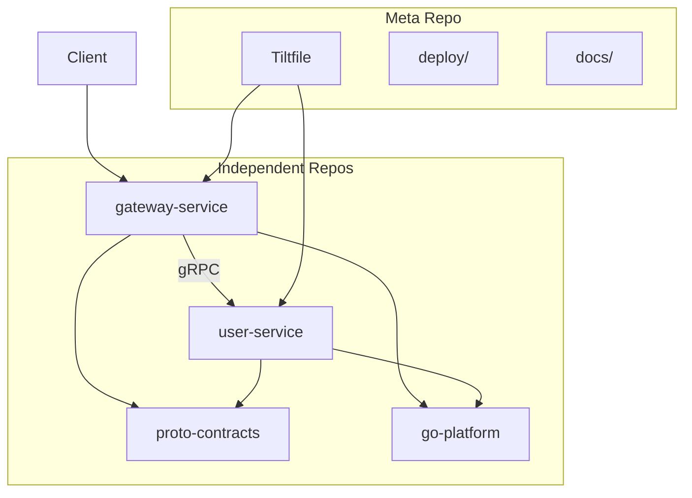

# Go gRPC Microservice Template (Polyrepo)

A production-ready **polyrepo** backend template for building Go microservices with **gRPC**, **Fiber HTTP gateway**, centralized **protobuf** contracts, **observability**, and **Kubernetes** deployment.

Inspired by [go-fiber-template](https://github.com/imkhoirularifin/go-fiber-template).

## Polyrepo layout

Each service and shared library lives in its own repository under `repos/`. The root repository is a **meta/orchestration repo** for local development (Tilt), deployment manifests, and documentation.

```
go-grpc-microservice-template/     # Meta repo (this repo)
├── repos/
│   ├── proto-contracts/           # Centralized .proto + generated Go stubs
│   ├── go-platform/               # Shared Go libraries
│   ├── gateway-service/           # Fiber HTTP gateway
│   └── user-service/              # Example gRPC service
├── deploy/                        # Kubernetes + monitoring manifests
├── docs/                          # Contributing & feature guides
├── go.work                        # Local Go workspace linking all repos
├── Tiltfile                       # Local dev orchestration
└── Makefile                       # Cross-repo commands
```

| Repository | Module | Responsibility |
|------------|--------|----------------|
| [proto-contracts](repos/proto-contracts) | `github.com/imkhoirularifin/proto-contracts` | API contracts, Buf codegen |
| [go-platform](repos/go-platform) | `github.com/imkhoirularifin/go-platform` | Config, logging, OTel, gRPC helpers |
| [gateway-service](repos/gateway-service) | `github.com/imkhoirularifin/gateway-service` | Fiber HTTP → gRPC proxy |
| [user-service](repos/user-service) | `github.com/imkhoirularifin/user-service` | User gRPC service |

## Features

| Area | Stack |
|------|-------|
| Language | Go 1.22 |
| Architecture | Polyrepo with `go.work` for local dev |
| HTTP | [Fiber v2](https://gofiber.io/) |
| RPC | gRPC with versioned proto-contracts repo |
| Proto tooling | [Buf](https://buf.build/docs) |
| Tracing | OpenTelemetry (OTLP) |
| Metrics | Prometheus |
| Local dev | [Tilt](https://docs.tilt.dev) |
| Deployment | Docker + Kubernetes (Kustomize) |

## Architecture



## Quick start

### Prerequisites

- Go 1.22+
- [Buf CLI](https://buf.build/docs/installation)
- Docker + [Tilt](https://docs.tilt.dev/install.html)
- kubectl + local Kubernetes (kind, minikube, or Docker Desktop)

### Setup

```bash
git clone https://github.com/imkhoirularifin/go-grpc-microservice-template.git
cd go-grpc-microservice-template

# Optional: replace vendored repos with git submodules
# git submodule update --init --recursive

make proto
make tidy
```

### Run locally (without Kubernetes)

```bash
# Terminal 1
cp repos/user-service/.env.example repos/user-service/.env
cd repos/user-service && go run ./cmd

# Terminal 2
cp repos/gateway-service/.env.example repos/gateway-service/.env
cd repos/gateway-service && go run ./cmd

curl http://localhost:8080/api/v1/users/1
```

### Run with Tilt

```bash
kind create cluster --name go-grpc-template
tilt up
```

### Observability stack

```bash
docker compose -f deploy/docker-compose.observability.yml up -d
```

## Splitting into separate GitHub repos

1. Create four repositories: `proto-contracts`, `go-platform`, `gateway-service`, `user-service`
2. Push each `repos/<name>/` directory to its repository
3. Tag `proto-contracts` and `go-platform` releases (`v1.0.0`, `v0.1.0`)
4. In this meta repo, replace vendored dirs with submodules (see `.gitmodules`)
5. Update service `go.mod` to pin tagged versions instead of `replace` directives

```bash
git submodule add -b v1.0.0 https://github.com/your-org/proto-contracts repos/proto-contracts
git submodule add -b v0.1.0 https://github.com/your-org/go-platform repos/go-platform
git submodule add https://github.com/your-org/gateway-service repos/gateway-service
git submodule add https://github.com/your-org/user-service repos/user-service
```

## Makefile targets

| Command | Description |
|---------|-------------|
| `make proto` | Generate Go code in proto-contracts |
| `make proto-lint` | Lint protobuf definitions |
| `make test` | Run tests in all repos |
| `make build` | Build gateway and user binaries |
| `make docker-build` | Build Docker images |
| `make tilt` | Start Tilt |

## Documentation

- [Contributing](docs/CONTRIBUTING.md)
- [Adding a new feature](docs/ADDING_NEW_FEATURE.md)
- Per-repo READMEs in `repos/*/README.md`

## License

MIT
