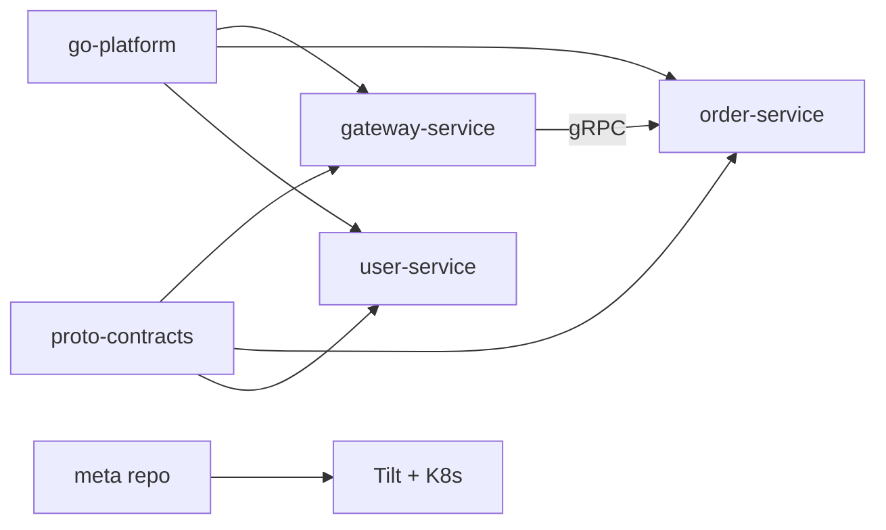

# Adding a New Feature (Polyrepo)

This guide walks through adding a new microservice feature across the polyrepo: protobuf contract → gRPC service → HTTP gateway → deployment.

Example: adding an **Order** service.

## Overview



## Step 1: Define the protobuf contract

Work in `repos/proto-contracts/`.

```protobuf
// repos/proto-contracts/order/v1/order.proto
syntax = "proto3";

package order.v1;

option go_package = "github.com/imkhoirularifin/proto-contracts/gen/go/order/v1;orderv1";

message Order {
  string id = 1;
  string user_id = 2;
  string status = 3;
}

service OrderService {
  rpc GetOrder(GetOrderRequest) returns (GetOrderResponse);
}
```

Generate and release:

```bash
cd repos/proto-contracts
make proto-lint
make proto
git tag v1.1.0
git push origin v1.1.0
```

## Step 2: Create the gRPC service repo

Create a new repository `repos/order-service/` (or a separate GitHub repo).

```
repos/order-service/
├── cmd/main.go
├── internal/
│   ├── handler/order.go
│   └── service/order.go
├── go.mod
├── Dockerfile
├── Makefile
└── README.md
```

`go.mod`:

```go
module github.com/imkhoirularifin/order-service

require (
    github.com/imkhoirularifin/go-platform v0.1.0
    github.com/imkhoirularifin/proto-contracts v1.1.0
)

replace (
    github.com/imkhoirularifin/go-platform => ../go-platform
    github.com/imkhoirularifin/proto-contracts => ../proto-contracts
)
```

Add config to `go-platform/pkg/config` if the new service needs shared env structs.

Register in root `go.work`:

```go
use (
    ./repos/order-service
)
```

## Step 3: Update the gateway

In `repos/gateway-service`:

1. Add gRPC client connection in `internal/infrastructure/server.go`
2. Create `internal/handler/order.go` with Fiber routes
3. Extend `GatewayConfig` in `go-platform/pkg/config` with order service host/port

## Step 4: Deployment (meta repo)

In the root `deploy/` directory:

1. Add `deploy/kubernetes/base/order.yaml`
2. Update `configmap.yaml` with order-service env vars
3. Add order resource to `Tiltfile`
4. Create `repos/order-service/Dockerfile` (copy from user-service)

```python
# Tiltfile
docker_build(
    'go-grpc-template/order',
    '.',
    dockerfile='repos/order-service/Dockerfile',
    only=['go.work', 'repos/go-platform', 'repos/proto-contracts', 'repos/order-service'],
)
```

## Step 5: Verify

```bash
# From meta repo root
make proto
make tidy
make test
make build
tilt up

curl http://localhost:8080/api/v1/orders/1
```

## Checklist

- [ ] `.proto` added and tagged in `proto-contracts`
- [ ] `make proto` run, `gen/go/` committed in proto-contracts
- [ ] New service repo created with own `go.mod` and CI
- [ ] `go.work` updated in meta repo
- [ ] Gateway routes added
- [ ] K8s manifests and Tiltfile updated
- [ ] Service `go.mod` pins tagged proto/platform versions for production

## Related docs

- [Contributing](./CONTRIBUTING.md)
- [proto-contracts README](../repos/proto-contracts/README.md)
- [Buf documentation](https://buf.build/docs)
- [Tilt documentation](https://docs.tilt.dev)
