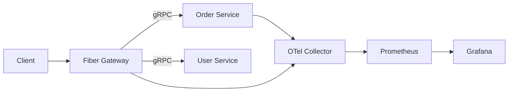

# Adding a New Feature

This guide walks through adding a new microservice feature end-to-end: protobuf contract, gRPC service, HTTP gateway route, observability, deployment, and local development.

We use an **Order** feature as an example. Adapt the names to your domain.

## Overview



## Step 1: Define the protobuf contract

Add the `.proto` file in the centralized contracts repository (submodule at `proto/contracts`).

```protobuf
// proto/contracts/order/v1/order.proto
syntax = "proto3";

package order.v1;

option go_package = "github.com/imkhoirularifin/go-grpc-microservice-template/gen/go/order/v1;orderv1";

message Order {
  string id = 1;
  string user_id = 2;
  string status = 3;
}

message GetOrderRequest {
  string id = 1;
}

message GetOrderResponse {
  Order order = 1;
}

service OrderService {
  rpc GetOrder(GetOrderRequest) returns (GetOrderResponse);
}
```

### Versioning

1. Commit and tag the proto repo: `v1.2.0`
2. Update the submodule in this repository:
   ```bash
   cd proto/contracts
   git fetch --tags
   git checkout v1.2.0
   cd ../..
   git add proto/contracts
   git commit -m "chore(proto): bump contracts to v1.2.0"
   ```

### Generate Go code

```bash
make proto-lint
make proto
```

Generated files appear under `gen/go/order/v1/`.

## Step 2: Create the gRPC service

### 2.1 Add service entrypoint

Create `cmd/order/main.go` following `cmd/user/main.go`:

- Load config from environment
- Initialize observability (tracing + metrics)
- Register the gRPC server with OTel interceptors
- Graceful shutdown on SIGTERM

### 2.2 Implement business logic

```
internal/order/
├── handler/
│   └── order.go      # gRPC handler (thin)
└── service/
    └── order.go      # Business logic + interfaces
```

Pattern:

```go
// internal/order/service/order.go
type OrderService interface {
    GetOrder(ctx context.Context, id string) (*Order, error)
}

// internal/order/handler/order.go
type OrderHandler struct {
    orderv1.UnimplementedOrderServiceServer
    service service.OrderService
}
```

### 2.3 Add configuration

Extend `pkg/config/config.go`:

```go
type OrderConfig struct {
    AppName     string `env:"APP_NAME" envDefault:"order-service"`
    GoEnv       string `env:"GO_ENV" envDefault:"development"`
    GRPCPort    string `env:"ORDER_GRPC_PORT" envDefault:"50052"`
    MetricsPort string `env:"ORDER_METRICS_PORT" envDefault:"9092"`
    Otel        OtelConfig `envPrefix:"OTEL_"`
    Log         LogConfig  `envPrefix:"LOG_"`
}
```

Update `.env.example` with the new variables.

## Step 3: Expose HTTP routes in the gateway

Add a Fiber handler that calls the gRPC client:

```
internal/gateway/handler/order.go
```

```go
func (h *OrderHandler) GetOrder(c *fiber.Ctx) error {
    resp, err := h.client.GetOrder(c.UserContext(), &orderv1.GetOrderRequest{
        Id: c.Params("id"),
    })
    if err != nil {
        return fiber.NewError(fiber.StatusBadGateway, "failed to fetch order")
    }
    return c.JSON(dto.Response{Message: "order found", Data: resp.Order})
}
```

Register routes in `internal/gateway/infrastructure/server.go`:

```go
orderClient := orderv1.NewOrderServiceClient(orderConn)
orderHandler := handler.NewOrderHandler(orderClient)
orderHandler.Register(api.Group("/orders"))
```

## Step 4: Add observability

Observability is built into shared packages:

| Layer | Package | What it does |
|-------|---------|--------------|
| gRPC server | `pkg/grpcutil` | OTel stats handler |
| gRPC client | `pkg/grpcutil` | OTel client handler |
| HTTP gateway | `otelfiber` middleware | Trace HTTP requests |
| Metrics | `pkg/observability` | Prometheus `/metrics` endpoint |
| Traces | `pkg/observability` | OTLP export to collector |

Set per-service environment variables:

```env
OTEL_SERVICE_NAME=order-service
OTEL_EXPORTER_OTLP_ENDPOINT=otel-collector:4317
ORDER_METRICS_PORT=9092
```

## Step 5: Deployment

### Docker

Create `deploy/docker/order.Dockerfile` (copy from `user.Dockerfile`).

Add a Makefile target:

```makefile
docker-build:
    docker build -f deploy/docker/order.Dockerfile -t go-grpc-template/order:latest .
```

### Kubernetes

Add `deploy/kubernetes/base/order.yaml`:

- Deployment with 2 replicas (adjust per environment)
- Service exposing gRPC and metrics ports
- Readiness/liveness probes
- Resource requests/limits

Update `deploy/kubernetes/base/configmap.yaml` with order-service env vars.

Add the resource to `deploy/kubernetes/base/kustomization.yaml`.

### Gateway connection

Update gateway ConfigMap:

```yaml
ORDER_GRPC_HOST: order
ORDER_GRPC_PORT: "50052"
```

## Step 6: Local development with Tilt

Update `Tiltfile`:

```python
docker_build(
    'go-grpc-template/order',
    '.',
    dockerfile='deploy/docker/order.Dockerfile',
    only=['cmd', 'internal', 'pkg', 'lib', 'gen', 'go.mod', 'go.sum'],
)

k8s_resource(
    'order',
    port_forwards=['50052:50052', '9092:9092'],
    resource_deps=['proto-gen'],
    labels=['services'],
)

k8s_resource(
    'gateway',
    resource_deps=['user', 'order'],
)
```

Run:

```bash
tilt up
```

## Step 7: Verify

```bash
# Health check
curl http://localhost:8080/api/v1/healthz

# New endpoint
curl http://localhost:8080/api/v1/orders/1

# Metrics
curl http://localhost:9092/metrics
```

## Checklist

- [ ] `.proto` added to centralized contracts repo and tagged
- [ ] Submodule updated in this repo
- [ ] `make proto` run and `gen/go/` committed
- [ ] gRPC service implemented (`cmd/`, `internal/`)
- [ ] Gateway HTTP routes added
- [ ] Config and `.env.example` updated
- [ ] Docker image and Kubernetes manifests added
- [ ] Tiltfile updated for local dev
- [ ] Tests added for service layer
- [ ] `docs/CONTRIBUTING.md` unchanged unless workflow differs

## Related docs

- [Contributing](./CONTRIBUTING.md)
- [Buf documentation](https://buf.build/docs)
- [Tilt documentation](https://docs.tilt.dev)
- [Go Fiber template reference](https://github.com/imkhoirularifin/go-fiber-template)
